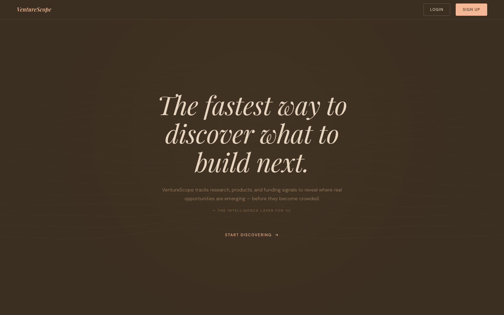
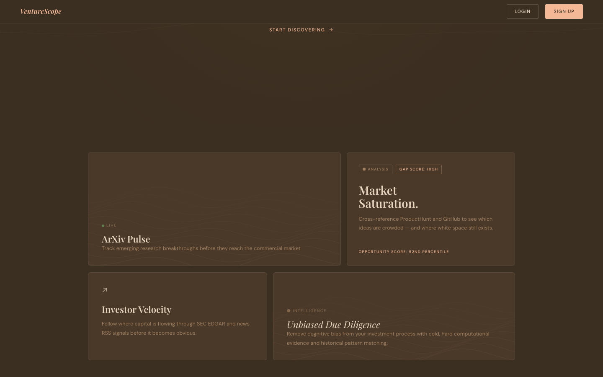
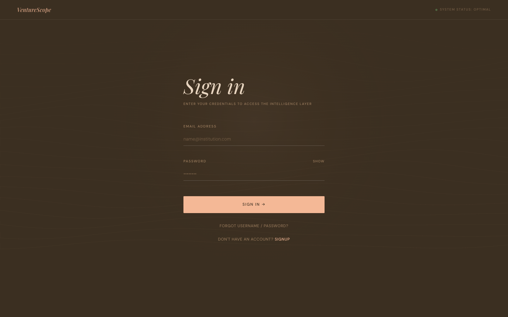
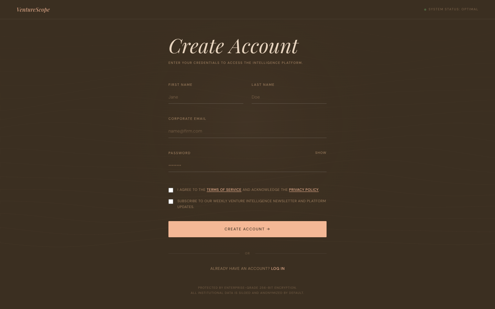
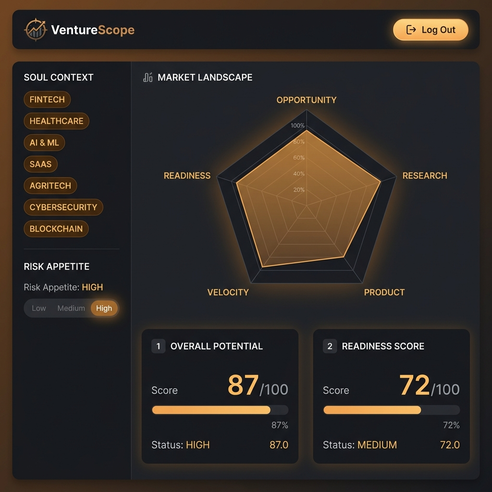
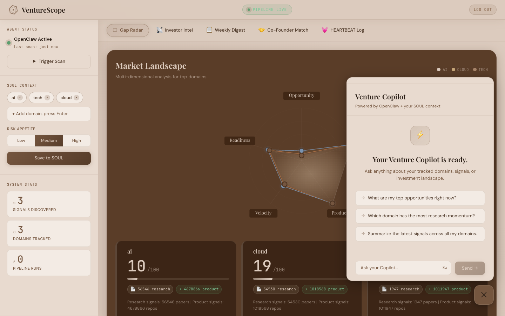
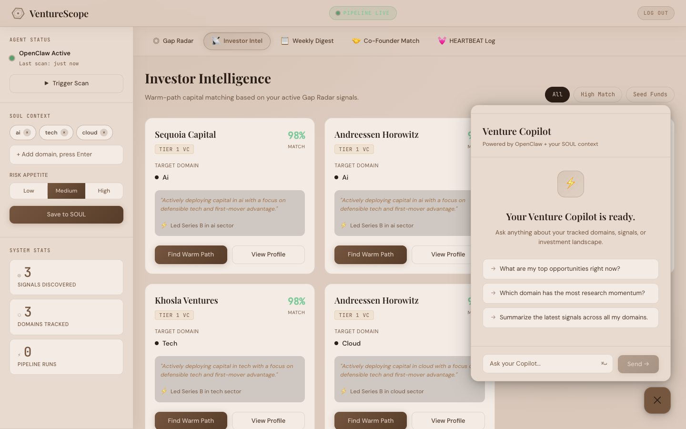
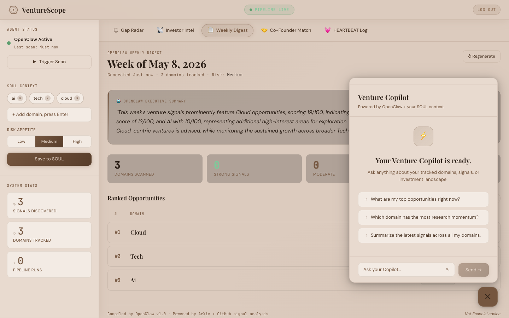
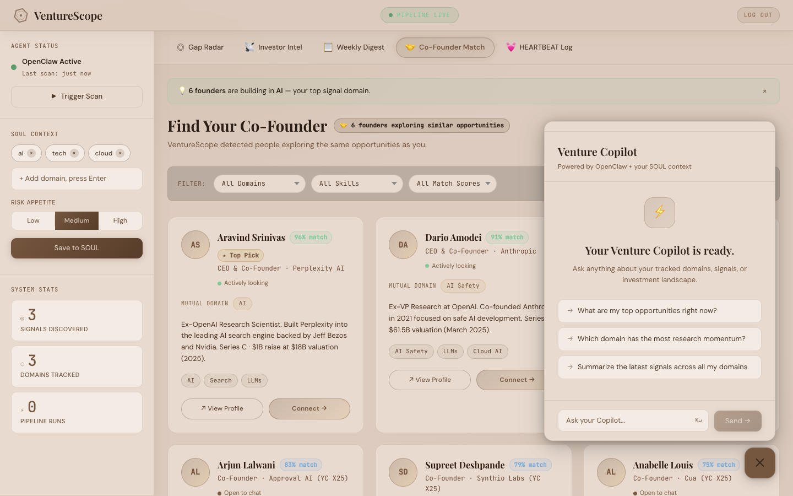

# VentureScope

> **The fastest way to discover what to build next.**  
> An AI-powered intelligence radar for the first movers of venture capital.

[](https://opensource.org/licenses/MIT)
[](https://react.dev/)
[](https://vitejs.dev/)
[](https://supabase.com/)
[](https://deepmind.google/technologies/gemini/)
[](https://www.emailjs.com/)



> **Live at:** [github.com/Thatblazerguy/VentureScope](https://github.com/Thatblazerguy/VentureScope)

---

## Overview

**VentureScope** is a full-stack, AI-powered market intelligence platform built for venture capitalists, startup founders, and early-stage investors. It continuously scans the gap between academic research and commercial product activity to surface investment opportunities before they become mainstream.

At its core, VentureScope uses **OpenClaw** — an autonomous multi-agent pipeline — to crawl ArXiv research papers, GitHub repositories, and market signals. It maps these against your personal **SOUL Context** (your domain interests and risk appetite) and ranks them into actionable opportunity scores.

The platform provides five integrated intelligence modules accessible via a persistent dashboard, with a globally available **Venture Copilot** chatbot (powered by Gemini 2.5 Flash + OpenClaw) that answers domain questions in real time using your live context.

**Who it's for:**
- VC associates who need to triage 100s of domains weekly
- Pre-seed founders validating market whitespace
- Angel investors seeking early-mover advantage signals

---

## Screenshots

### 🏠 Landing Page — Hero


### 🏠 Landing Page — Features


*Animated warm contour-line canvas, hero headline, ArXiv Pulse · Market Saturation · Gap Scores feature cards.*

### 🔐 Sign In


### 📝 Sign Up + OTP Verification


*2-step: registration form → 6-digit EmailJS OTP verification sent to inbox.*

### 📊 Dashboard — Gap Radar


*Pentagon radar chart + opportunity score cards. Left sidebar with SOUL Context editor, Risk Appetite toggle, Agent Status.*

### ⚡ Venture Copilot


*Floating slide-up popup — Gemini 2.5 Flash streaming chatbot, accessible from every tab.*

### 📡 Investor Intel


*Warm-path matched investor cards for Sequoia, a16z, Founders Fund etc. based on active Gap Radar domains.*

### 📋 Weekly Digest


*OpenClaw executive summary + ranked opportunity table with signal classifications.*

### 🤝 Co-Founder Match


*Real founder profiles — Aravind Srinivas, Dario Amodei, YC Spring 2025 founders — matched to your domains.*

### 💓 HEARTBEAT Log


*Real-time SSE terminal streaming live OpenClaw pipeline activity.*

---

## Features

### 🔭 Gap Radar
The primary intelligence module. Scores investment domains on a **0–100 whitespace scale** derived from five axes:

| Axis | What it measures |
|------|-----------------|
| **Opportunity** | Overall gap between research and market |
| **Research** | Academic momentum (ArXiv paper volume) |
| **Product** | Market saturation (GitHub repo count) |
| **Velocity** | Speed of emergence / research acceleration |
| **Readiness** | Commercial viability based on market activity |

Each domain gets an interactive **pentagon radar chart** (D3.js) overlaying up to 3 domains simultaneously. Clicking **"Explore Research"** on any score card expands an inline panel fetching live papers from Semantic Scholar / ArXiv. Cards with `★ Risk Match` are highlighted when the domain risk level matches your SOUL preference.

---

### ⚡ Venture Copilot (Floating Widget)
A globally accessible, **floating chatbot** (bottom-right, fixed position) powered by **Gemini 2.5 Flash** via the OpenClaw pipeline.

- Appears as a `⚡` trigger button with a green live-indicator dot
- Opens a `420×580px` slide-up panel — **no page navigation required**
- Supports **real-time streaming responses** via `ReadableStream` chunked decoding
- Context-aware: the copilot reads your current SOUL domains and opportunity data
- Uses `streamCopilotMessage()` from `lib/api.js` with `AbortController` for cancellation
- Accessible from every tab — persists chat state across tab switches
- Mobile-responsive: full-width at `≤520px`

---

### 📡 Investor Intel
Surfaces **warm-path matched investors** based on your active Gap Radar signals.

- Generates investor cards dynamically from live opportunity data (domain × score → VC fund match)
- Includes **11 real fund profiles**: Sequoia, a16z, Founders Fund, Khosla, Benchmark, Index, First Round, LocalGlobe, Initialized, NFX, Pear VC — with AUM, HQ, key partners, and portfolio companies
- **"Find Warm Path"** modal reveals a step-by-step connection route (4-node animated chain: You → Event/Portfolio → Partner → Investor)
- **"View Profile"** opens a full-screen drawer with fund overview, thesis, partners, and portfolio grid
- Filter pills: All / High Match / Seed Funds
- Match scores are derived from the gap score of each domain opportunity

---

### 📋 Weekly Digest
An **OpenClaw-generated executive briefing** on your tracked domains.

- Pulls from `GET /digest` — a pre-generated JSON report from the autonomous pipeline
- **AI narrative** (OpenClaw executive summary) shown in a styled block quote
- **Stats row**: Domains Scanned · Strong Signals · Moderate · Saturated
- **Ranked opportunity table** with expandable rows showing: Recommended Action, Gap Score, Last Updated, and full AI summary
- Signal classification: `STRONG_WHITESPACE` (purple) · `MODERATE` (amber) · `SATURATED` (grey)
- Includes a **"Regenerate"** button hitting `POST /digest/generate`
- Filter pills: All / Strong / Moderate / Saturated

---

### 🤝 Co-Founder Match
A curated directory of **real-world founders** building in AI-adjacent spaces, matched to your domains.

Built with a sample of limited verified public profiles sourced from TechCrunch and YC Directory:

| Founder | Company | Score | Source |
|---------|---------|-------|--------|
| Aravind Srinivas | Perplexity AI (Series C, $18B) | 96% ★ Top Pick | LinkedIn |
| Dario Amodei | Anthropic (Series E, $61.5B) | 91% | LinkedIn |
| Tim Shi | Cresta (Series C, $270M+) | 88% | LinkedIn |
| Arjun Lalwani | Approval AI (YC X25) | 83% | YC Directory |
| Supreet Deshpande | Synthio Labs (YC X25) | 79% | YC Directory |
| Anabelle Louis | Cua (YC X25) | 75% | YC Directory |

- **★ Top Pick** amber badge for umbrella-match entries (`isUmbrellaMatch: true`)
- **↗ View Profile** links directly to LinkedIn/YC profile in a new tab
- Filter dropdowns: Mutual Domain · Skills · Match Score band
- Cards show: avatar initials, match % badge, role, domain, bio, skill tags, status dot

---

### 💓 HEARTBEAT Log
A **real-time terminal interface** streaming live activity from the OpenClaw autonomous pipeline.

- Connects via `EventSource` (Server-Sent Events) to `GET /logs/stream`
- Auto-scrolls to latest log entry
- Keeps last **100 lines** in memory
- Color-coded log levels:
  - `INFO` → muted grey
  - `SCAN` → parchment
  - `RESULT` → amber
  - `DB` → green
  - `DONE` → amber-light
  - `ERROR` → danger red
- Format: `[HH:MM:SS] LEVEL   message`

---

### 🧠 SOUL Context System
The persistent user profile that drives all AI personalization.

Managed in the **left sidebar** across the entire dashboard:

- **Domain Tags**: Add/remove interest domains with tag chip UI (Enter to add, Backspace to remove last)
- **Risk Appetite**: Three-way toggle — Low / Medium / High — affects Gap Radar card highlighting and ★ Risk Match badges
- **"Save to SOUL"** button: PATCHes `/context` endpoint, writes to Supabase, and updates `openclaw/SOUL.md`
- **Agent Status Widget**: Green pulsing dot when OpenClaw scanned within the last 5 minutes. Shows "Last scan: X mins ago" with live ticker (updates every 30s)
- **"Trigger Scan"** button: manually kicks off a fresh pipeline run
- **System Stats**: Animated count-up tiles for Signals Discovered · Domains Tracked · Pipeline Runs

---

### 🤖 OpenClaw Integration
OpenClaw is the autonomous AI backbone running as a separate Node.js service.

- Runs on **port 4000** (configurable via `.env`)
- **Skills system**: modular task handlers in `/openclaw/skills/`
- Continuously crawls ArXiv + GitHub, scoring each domain on research vs. product signal ratios
- Writes results to **Supabase** (`opportunities` table)
- Generates the Weekly Digest JSON on demand
- Exposes a **streaming `/chat` endpoint** consumed by the Venture Copilot
- Streams `/logs` via SSE for the HEARTBEAT terminal
- Uses **Gemini 2.5 Flash** as the primary LLM (`LLM_MODEL=gemini-2.5-flash`)
- **SOUL.md** is a Markdown file read by OpenClaw as user context on every pipeline run

---

## Tech Stack

| Layer | Technology |
|-------|-----------|
| **Frontend Framework** | React 18 + Vite 5 |
| **Styling** | Vanilla CSS with CSS custom properties (warm brown design system) |
| **Charts / Visualization** | D3.js v7 (radar chart, animated canvas) |
| **Auth (DB)** | Supabase (`@supabase/supabase-js`) |
| **Email OTP** | EmailJS (`@emailjs/browser`) |
| **AI / LLM** | Google Gemini 2.5 Flash |
| **Backend** | Node.js + Express (port 3000) |
| **Autonomous Agent** | OpenClaw (Node.js, port 4000) |
| **Real-time Streaming** | `ReadableStream` + `EventSource` (SSE) |
| **Database** | Supabase (PostgreSQL hosted) |
| **Typography** | Google Fonts — Playfair Display, DM Sans, JetBrains Mono |
| **Package Manager** | npm |
| **Build Tool** | Vite 5 |

---

## Project Structure

```
VentureScope/
├── frontend/                    # React 18 + Vite SPA
│   ├── src/
│   │   ├── main.jsx             # Root router (landing/login/signup/app states)
│   │   ├── App.jsx              # Dashboard shell, data fetching, tab routing
│   │   ├── LandingPage.jsx      # Marketing landing with animated canvas
│   │   ├── LoginPage.jsx        # Direct sign-in (email + password)
│   │   ├── SignupPage.jsx       # 2-step sign-up + EmailJS OTP verification
│   │   ├── landing.css          # Landing page styles
│   │   ├── login.css            # Auth pages design system
│   │   ├── index.css            # Global CSS variables, dashboard styles
│   │   ├── lib/
│   │   │   ├── api.js           # API client (fetch + Supabase auth headers)
│   │   │   └── supabase.js      # Supabase client initialisation
│   │   ├── utils/
│   │   │   └── emailAuth.js     # EmailJS OTP utility (generateOTP, sendVerificationEmail)
│   │   └── components/
│   │       ├── Navbar.jsx       # Fixed top bar with Pipeline Health chip + Log Out
│   │       ├── Sidebar.jsx      # SOUL editor, Agent Status, System Stats
│   │       ├── TabNav.jsx       # Horizontal tab navigation
│   │       ├── GapRadar.jsx     # D3 radar chart + score cards + research panel
│   │       ├── CopilotChat.jsx  # Chat UI with streaming (used inside CopilotWidget)
│   │       ├── CopilotWidget.jsx# Floating button + popup panel wrapper
│   │       ├── InvestorIntel.jsx# Investor cards, warm-path modal, profile drawer
│   │       ├── WeeklyDigest.jsx # Digest table, AI narrative, stats row
│   │       ├── CoFounderMatch.jsx# Founder cards with real data
│   │       └── HeartbeatLog.jsx # SSE terminal log viewer
│   ├── package.json
│   └── vite.config.js
│
├── backend/                     # Express API Gateway (port 3000)
│   └── src/
│       └── index.js             # Routes: /opportunities, /context, /papers, /copilot, /digest, /logs
│
├── openclaw/                    # Autonomous AI pipeline (port 4000)
│   ├── run.js                   # Entry point — orchestrates scan cycles
│   ├── server.js                # Express server: /chat, /logs/stream
│   ├── SOUL.md                  # User context file (domains, risk appetite)
│   ├── HEARTBEAT.md             # Pipeline status log
│   ├── digest.json              # Latest generated weekly digest
│   └── skills/                  # Modular skill handlers
│
├── intelligence/                # Research domain config
│   └── SOUL.md
│
├── docs/
│   └── screenshots/             # UI screenshots for this README
│
├── start.sh                     # One-command startup (Mac/Linux)
├── start.bat                    # One-command startup (Windows)
└── .env.example                 # Template for all environment variables
```

---

## Getting Started

### Prerequisites

```bash
node --version    # v18+ required
npm --version     # v9+ required
```

You also need:
- A [Supabase](https://supabase.com/) project with an `opportunities` table
- A [Google AI Studio](https://aistudio.google.com/) API key (Gemini)
- An [EmailJS](https://www.emailjs.com/) account with a service + template configured

---

### Installation

```bash
git clone https://github.com/Thatblazerguy/VentureScope.git
cd VentureScope

# Install all dependencies
cd frontend && npm install && cd ..
cd backend && npm install && cd ..
cd openclaw && npm install && cd ..
```

---

### Environment Variables

#### `backend/.env`

```env
SUPABASE_URL=https://your-project.supabase.co
SUPABASE_ANON_KEY=your_anon_key
SUPABASE_SERVICE_ROLE_KEY=your_service_role_key
SUPABASE_OPPORTUNITIES_TABLE=opportunities
FRONTEND_ORIGIN=http://localhost:5173
OPENCLAW_COPILOT_URL=http://localhost:4000/chat
LLM_API_KEY=your_gemini_api_key
LLM_MODEL=gemini-2.5-flash
```

#### `frontend/src/.env.local`

```env
VITE_API_URL=http://localhost:3000
VITE_SUPABASE_URL=https://your-project.supabase.co
VITE_SUPABASE_ANON_KEY=your_anon_key
```

#### `openclaw/.env`

```env
GEMINI_API_KEY=your_gemini_api_key
PORT=4000
```

#### EmailJS (hardcoded in `frontend/src/utils/emailAuth.js`)

```env
# Update these constants directly in emailAuth.js:
SERVICE_ID  = your_emailjs_service_id
TEMPLATE_ID = your_emailjs_template_id
PUBLIC_KEY  = your_emailjs_public_key
```

Your EmailJS template should use these variables: `{{to_email}}`, `{{to_name}}`, `{{verification_code}}`

---

### Running Locally

**Option A — One command (Mac/Linux):**

```bash
chmod +x start.sh && ./start.sh
```

**Option B — Windows:**

```bat
start.bat
```

**Option C — Manual (3 terminals):**

```bash
# Terminal 1 — Backend API
cd backend && npm start

# Terminal 2 — OpenClaw Agent
cd openclaw && node run.js

# Terminal 3 — Frontend
cd frontend && npm run dev
```

The app will be available at **http://localhost:5173**

---

## Authentication

### Sign In
Direct authentication — email + password → immediate dashboard access. No OTP required.

### Sign Up (2-Step)
1. **Step 1**: Fill in first name, last name, corporate email, password, and agree to Terms
2. **Step 2**: VentureScope generates a 6-digit OTP and sends it to the entered email via **EmailJS**
3. Enter the code in the 6-box digit input → verified → account created

The OTP is generated client-side using `Math.random()` and validated in React state. For production use, pair this with a Supabase Auth flow for server-side session management.

### Log Out
Clicking **LOG OUT** in the top-right navbar returns the user to the landing page. Session state is managed in `main.jsx` via React `useState`.

---

## Deployment

### Frontend → Vercel

1. Push to GitHub (already done)
2. Go to [vercel.com](https://vercel.com) → New Project → select repo
3. Set **Root Directory**: `frontend`
4. Add environment variables from `frontend/src/.env.local`
5. Deploy

### Backend → Render

1. Go to [render.com](https://render.com) → New Web Service
2. Connect your GitHub repo
3. **Root Directory**: `backend`
4. **Build Command**: `npm install`
5. **Start Command**: `npm start`
6. Add all `backend/.env` variables
7. Update `FRONTEND_ORIGIN` to your Vercel URL

### OpenClaw → Render (Second Service)

Same as backend but:
- **Root Directory**: `openclaw`
- **Start Command**: `node server.js`
- Update `OPENCLAW_COPILOT_URL` in your backend env to point to this Render URL

---

## Roadmap

- [ ] Real Supabase Auth session management (replace client-side OTP validation)
- [ ] ArXiv live paper fetching (currently via Semantic Scholar fallback)
- [ ] GitHub trending repository ingestion for product signal enrichment
- [ ] Multi-user SOUL profiles with persistent Supabase storage
- [ ] Export Gap Radar report as PDF
- [ ] Email digest delivery (weekly digest emailed via EmailJS)
- [ ] Mobile-first responsive layout improvements
- [ ] Dark/light mode toggle
- [ ] Public API for embedding gap scores in external tools

---

## Contributing

Contributions are welcome!

1. Fork the repository
2. Create a feature branch: `git checkout -b feature/your-feature-name`
3. Commit your changes: `git commit -m 'Add feature X'`
4. Push to the branch: `git push origin feature/your-feature-name`
5. Open a Pull Request

Please follow the existing code style — inline styles with CSS custom properties, no Tailwind unless the component already uses it.

---

## License

MIT License — see [LICENSE](LICENSE) for details.

---

## Built with ❤️ by VentureScope

> *"Building the computational foundation for the next decade of venture capital."*

**Stack**: React · Vite · Express · Supabase · Gemini AI · D3.js · EmailJS  
**Repo**: [github.com/Thatblazerguy/VentureScope](https://github.com/Thatblazerguy/VentureScope)
